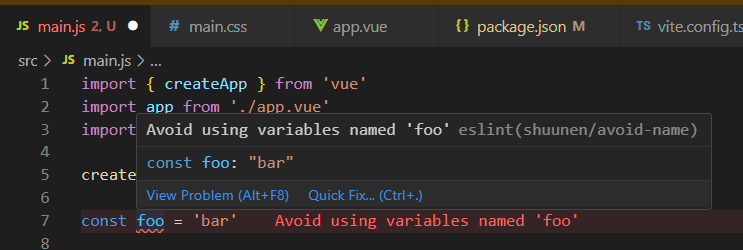

# eslint-plugin-shuunen

[](https://packagephobia.com/result?p=eslint-plugin-shuunen)
[](https://bundlephobia.com/package/eslint-plugin-shuunen)
[](https://www.npmjs.com/package/eslint-plugin-shuunen)
[](https://codeclimate.com/github/Shuunen/eslint-plugin-shuunen)
[](https://github.com/Shuunen/eslint-plugin-shuunen/blob/master/LICENSE)



## Demo

There not much to show, but here is a super useful eslint rule from this package in action :



## Installation

```bash
pnpm install -D eslint-plugin-shuunen
```

## ES Module

In your `eslint.config.js` :

```js
import shuunen from 'eslint-plugin-shuunen'

export default [                    // 🥗 compose your salad
  ...shuunen.configs.base,          // 🥚 eslint/all + unicorn/all + perfectionist/natural + jsdoc
  // ...shuunen.configs.browser,    // 🥑 globals for browser
  // ...shuunen.configs.node,       // 🥕 globals for node
  // ...shuunen.configs.typescript, // 🍅 typescript/all
  // ...shuunen.configs.vue,        // 🥔 vue/recommended
]
```

## CommonJS (legacy)

In your `eslint.config.cjs` :

```js
const shuunen = require('eslint-plugin-shuunen')

/** @type {import('eslint').Linter.Config} */
module.exports = [               
  ...shuunen.configs.base,       
  ...shuunen.configs.browser,    
  ...shuunen.configs.node,       
  ...shuunen.configs.typescript, 
  ...shuunen.configs.vue,        
]
```

You can adjust the rules to your taste :

```js
module.exports = [
  ...shuunen.configs.base,
  {
    rules: {
      'shuunen/some-rule': 'off',
      'unicorn/some-other-rule': 'warn',
    },
  },
]
```

## Features

- [x] awesomely opinionated plugins & rules :sparkles:

## TODO

- [ ] use a plugin for react
- [ ] merge typescript into base because it works on js ^^
- [ ] search interesting plugins from [eslint-plugin-antfu](https://github.com/antfu/eslint-config)
- [ ] search interesting plugins from [eslint-plugin-hardcore](https://github.com/EvgenyOrekhov/eslint-config-hardcore)
- [ ] test to build a index.min.js file and see how it impact :
  - [ ] the install size
  - [ ] the performance
  - [ ] the source code readability in case of error

## Thanks

- [Anthony Fu](https://github.com/antfu/eslint-config) : for his config, for the inspiration
- [Dependency-cruiser](https://github.com/sverweij/dependency-cruiser) : handy tool to validate and visualize dependencies
- [Esbuild](https://github.com/evanw/esbuild) : an extremely fast JavaScript bundler and minifier
- [Eslint](https://eslint.org) : super tool to find & fix problems
- [Github](https://github.com) : for all their great work year after year, pushing OSS forward
- [Npm-parallel](https://github.com/spion/npm-parallel) : to keep my npm scripts clean & readable
- [Repo-checker](https://github.com/Shuunen/repo-checker) : eslint cover /src code and this tool the rest ^^
- [Shields.io](https://shields.io) : for the nice badges on top of this readme
- [Sindre Sorhus](https://github.com/sindresorhus/eslint-plugin-unicorn) : for his awesome eslint-plugin-unicorn, for the inspiration
- [V8](https://github.com/demurgos/v8-coverage) : simple & effective cli for code coverage
- [Vitest](https://github.com/vitest-dev/vitest) : super fast vite-native testing framework
- [Watchlist](https://github.com/lukeed/watchlist) : recursively watch a list of directories & run a command on any file system

## Stargazers over time

[](https://starchart.cc/Shuunen/eslint-plugin-shuunen)

## Page views

[](https://www.websitecounterfree.com)
